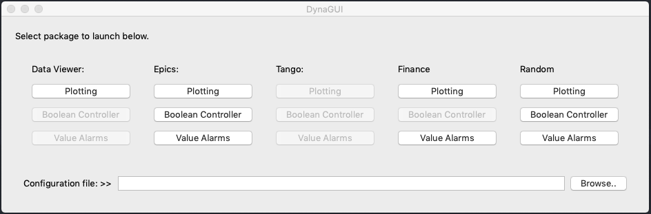
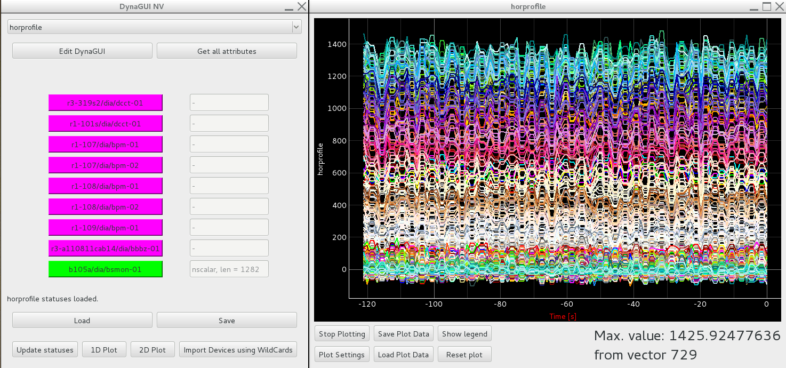
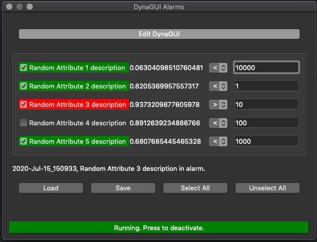

# DynaGUI README

DynaGUI stands for Dynamic Graphical User Interface and is a method to construct temporary, permanent and/or a set of GUI:s for users in a simple and fast manner. Developed during shift works at a particle accelerator, the initial goal was to fill in some functions that were then missing: Fast dynamic construction of new control system GUI:s for various purposes.

Different devices can have different attributes, depending on what type of device it is. For example, the Beam Position Monitors (BPM:s) of a particle accelerator reveal information about the transverse beam position whilst magnets' power supplies both reads and can set the current set-point of the magnet.

The BPM:s' device servers do, however, not only reveal information about the beam itself but also contain information of how their data should be treated, such as if they may generate an interlock (InterlockEnabled) or if they should have the Automatic Gain Control enabled or disabled. These signals are handled as true or false flags, meaning that a simple GUI can be constructed to read and also control the true or false-flags. This was the initial application in the package, which is the DynaGUI TF. For simplicity reasons, their states are revealed by their colour:
True = Green
False = Red
non-valid attribute = Magenta
Device disconnected = Maroon

For the case of having a GUI that reads numerical values, each device needs two fields: A field with the domain address for the device and another with the numerical value of the defined attribute, which resulted in the second application DynaGUI NV. This application has also evolved to enable 1D and 2D plotting (showing devices along the vertical axis, time along the horizontal axis, and the values using intensity colours).

The third and last application in this package is the DynaGUI Alarms, which allows a user to set up a list of channels returning numerical values continuously and a second list of limit values (or conditions). This application sounds an alarm for the channel with a value not fulfilling the criteria and paints its description background red in the GUI. Since different devices can have different attributes, inside the DynaGUI NV and DynaGUI TF, the devices which do not have the selected attribute obtain a magenta-coloured background.

The package has then evolved to have the ability to analyse data from any file containing plot data and also live-streamed data from other sources, such as the stock market using Pandas. A random data value package has also been implemented for testing and demonstration purposes.

## Example usages
Example usages include multiple scenarios for simple financial analysis or at research and industrial complexes where a control system is used that can be incorporated within Python. We will address some case studies below for the different applications in this package.

The first package built was DynaGUI TF (TF = True/False) for the Tango control system with the goal to give the user a quick overview of user-defined devices' statuses of various boolean value attributes by giving each device their own button. Using colour coding for each devices' state, DynaGUI TF offers a time-efficient method for checking multiple devices' attribute states. DynaGUI TF was used a lot to check e.g. BPM statuses (e.g. is interlock enabled for them and is automatic gain control enabled). Whether they should be true or false can change over time, and therefore, it was important to check and ensure that all had proper states set.

Since the limitation with the DynaGUI TF was such that it could only read boolean values, the DynaGUI NV was developed such that numerical values could also be read. However, colour-coding cannot be used to show numerical value statuses, meaning that for this GUI, each device gets two objects, with the first being a button showing if the device is connected to and attribute is valid, if device is connected to but the attribute is not valid, or the device is disconnected (using colour-coding green, magenta and maroon, respectively.). The button can be clicked on to launch a control panel for the device or for more information about the device, whilst the second object is a label which shows the actual value (if it has been obtained). This has been used for launching control panels (AtkPanels) which are built on the Tango control system for the devices and for checking if their values are ok or not, such as the water temperatures and water flows for cooling magnets in the accelerator. It can also be used to plot the measured current from Beam Current Monitors and, by setting up user-defined functions, it can e.g. plot the difference in measured current between two (or more) beam charge monitors to monitor the beam current loss between them.

By using DynaGUI NV, the need for an alarm if a numerical value surpasses some limit was realised. Therefore, the DynaGUI Alarms application was realised as an extension to the two former applications, which was used to monitor e.g. transverse beam emittance and beam energy spread at a synchrotron. When the energy spread or emittance became higher than the user-defined limit, an alarm sounded and notified the operators.

As a future development to test the openness of DynaGUI NV and DynaGUI alarms, a "Finance" package was added to them to monitor stock prices: DynaGUI NV which monitors stock prices in a 1D plot with the ability for users to add functions that are applied to realtime stock price data, whilst DynaGUI Alarms sounds an alarm if a stock price becomes higher or lower than a user-defined limit.

## Screenshots
DynaGUI Launcher:
<table>
    <tr>
        <td>
            
        </td>
    </tr>
</table>

DynaGUI TF:
<table>
    <tr>
        <td>
            
        </td>
    </tr>
</table>

DynaGUI NV and 1D plotting:
<table>
    <tr>
        <td>
            
        </td>
    </tr>
</table>

DynaGUI NV 2D plotting:
<table>
    <tr>
        <td>
            
        </td>
    </tr>
</table>

DynaGUI Alarms:
<table>
    <tr>
        <td>
            
        </td>
    </tr>
</table>

## Installation procedure
In order to use the PyTango package, the TANGO Controls has to be installed, then follow steps b. TANGO Controls can be obtained from https://www.tango-controls.org/downloads/.

If TANGO is not required by the end user, see steps a.

1. In order to setup this package, ensure that Python 3.x (3.7 is recommended) is installed on the computer.
2. Check Python version used with the PIP package manager such that it points to the correct Python version (pip -V).
3. a) Use PIP to install all packages required, see [requirements](requirements.yml), or use conda to create an environment:

    conda env create --file environments.yml

   b) Use PIP to install all packages required, see [requirements](requirements_tango.yml), or use conda to create an environment:

    conda env create --file environments_tango.yml

4. If all required Python packages have been successfully installed, the package is ready.

To launch the package, browse to the package's destination in a terminal and execute | python Launcher.py | to launch DynaGUI.

## User Guide
The user guide contains more information on how to use the package, see [User Guide](UserGuide.pdf).

## Dependencies
The package depends on multiple Python packages depending on if it is to be used with Tango, EPICS, Finance, Random, or only historical data plotting and browsing.

## History
The package was initially developed in 2019 by Benjamin Bolling during his time as an Accelerator Operator at MAX IV Laboratory. It has since then evolved to its current state as it is today.

## Comparison to other packages
Many graphical user interface (GUI) toolkits exists for building GUI:s with the Python language, e.g. PyQt, Tkinter and wxPython. All three packages, however, requires that the user does now coding and has time to build a GUI. With the idea of this package being its openness and fast-paced construction for GUI:s, a similar package would be PyGTK which, however, requires a little amount of programming. The author is presently unaware of any Python-based dynamic GUI construction package.

## License
This package is intended to be free and open-source. For more information, see [license](LICENSE.txt).
